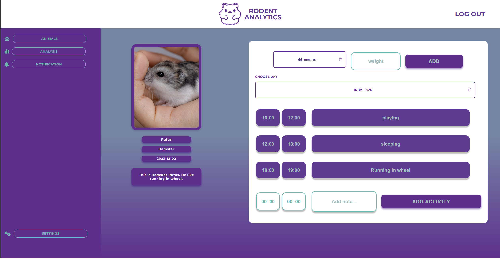

# Rodent Analysis

Take care of your rodents like never before! Our web and mobile application lets you easily add and manage information about your pet rodents. Track their daily activities, monitor their weight, and keep a detailed record of their well-being—all in one place.

With our intuitive interface, you can log important details about each of your rodents, including activity levels and weight changes. The app automatically generates easy-to-read charts, helping you visualize trends and monitor your pets’ health over time.

Stay organized and gain valuable insights into your rodents’ habits, whether you’re at home or on the go. You can also set up custom notifications, so you never forget important tasks—like feeding, cleaning, or health checkups.

Perfect for all rodent owners who want to ensure the best care for their furry friends!


## Requirements

- [Docker](https://www.docker.com/get-started) and [Docker Compose](https://docs.docker.com/compose/install/) must be installed on your system.

## Installation

1. Clone the repository:
    ```sh
    git clone <repository-url>
    cd <repository-folder>/RodentAnalysis/LAB01-Konfiguracja
    ```

2. Build and start all services using Docker Compose:
    ```sh
    docker-compose up --build
    ```

3. The application and all required services (such as the database) will start automatically in Docker containers.

## Usage

- Once the containers are running, open your browser and go to [http://localhost:3000](http://localhost:3000)  
  *(Replace `3000` with your configured port if different)*


## Preview

# Dashboard


# Pet Journal



# Mobile view


## Data Base

# Diagram ERD for data base


